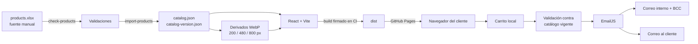
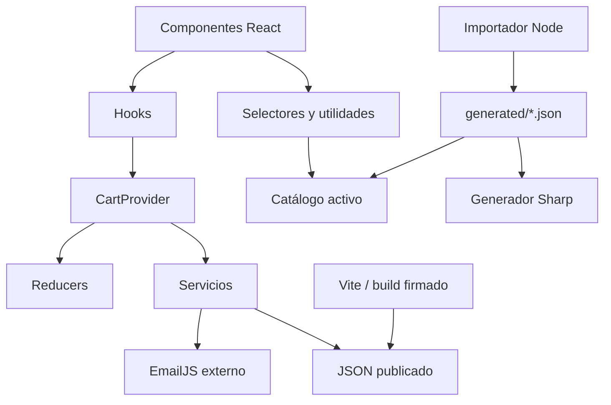
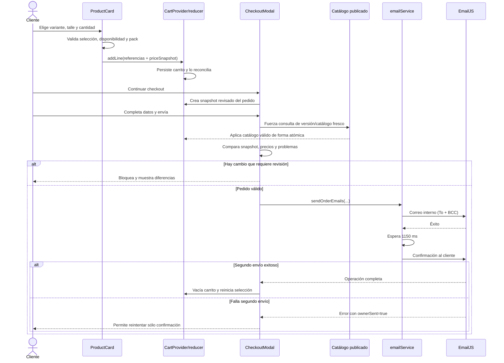
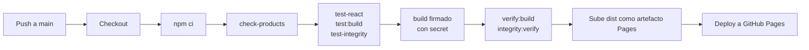

# Documentación técnica y arquitectónica de RealStep / HEAD

> Estado documentado: 2 de septiembre de 2026.
>
> Alcance: implementación presente en este repositorio. Este documento diferencia expresamente los hechos comprobados en el código de las interpretaciones técnicas y de las mejoras futuras.

## 1. Propósito y forma de leer este documento

Este repositorio implementa el catálogo mayorista de RealStep / HEAD. Es una aplicación web que publica productos deportivos, permite elegir variantes y talles, mantiene un carrito en el navegador y envía pedidos por correo electrónico mediante EmailJS.

La aplicación actual es deliberadamente **frontend-only**: no hay un backend propio, una API de pedidos, una base PostgreSQL ni Prisma. Los productos se administran en un archivo Excel, se convierten a JSON antes de publicar y se incorporan al sitio estático. Durante el checkout no se cobra ni se reserva inventario; se envía una solicitud de pedido sujeta a confirmación comercial.

Las expresiones usadas en este documento tienen este significado:

- **Hecho observado**: surge directamente de un archivo, una prueba o un comando del repositorio.
- **Interpretación técnica**: explica por qué una elección resulta razonable, pero no pretende atribuir una intención histórica que no está registrada.
- **Mejora futura**: no forma parte del sistema productivo actual.

Los números del catálogo son una fotografía del estado inspeccionado, no constantes de negocio: 148 productos, 133 variantes, 433 referencias de imágenes, 366 filas de stock y 630 valores de características. El catálogo declara `stockIsAvailabilityOnly: true`.

## 2. Visión general del sistema

### 2.1 Qué problema resuelve

El sistema convierte una fuente comercial cómoda de editar —`catalog/products.xlsx`— en un catálogo web navegable. Para el comprador ofrece:

- categorías y subcategorías;
- búsqueda de productos;
- productos con imágenes, variantes, talles, precios y reglas de pack;
- carrito persistente;
- validación del pedido contra el catálogo vigente;
- envío de una notificación interna y una confirmación al cliente.

Para quien administra el catálogo ofrece:

- validaciones antes de publicar;
- generación determinista de JSON;
- comparación contra un baseline comercial aprobado;
- optimización automática de imágenes;
- tests, build reproducible y publicación automática;
- comprobaciones de integridad criptográfica en la entrega firmada.

### 2.2 Qué tipo de aplicación es

Es una **SPA estática** construida con React y Vite. SPA significa *Single Page Application*: el navegador descarga una página HTML y el código JavaScript administra las vistas, los modales, el carrito y la navegación sin solicitar una página HTML distinta por cada categoría.

“Estática” no significa que la interfaz no cambie. Significa que el hosting sirve archivos preconstruidos —HTML, JavaScript, CSS, JSON e imágenes— y no ejecuta lógica de servidor propia ante cada visita. GitHub Pages cumple esa función.

### 2.3 Flujo general, desde Excel hasta el pedido



En términos operativos:

1. El administrador modifica el Excel y agrega los originales de imagen necesarios.
2. El importador lee y valida las hojas relacionadas.
3. Si todo es válido, genera `generated/catalog.json` y su hash en `generated/catalog-version.json`.
4. El proceso genera automáticamente las variantes responsive de las imágenes referenciadas.
5. Se revisa la diferencia comercial frente al baseline.
6. Se ejecutan tests y build.
7. Un `push` autorizado a `main` dispara GitHub Actions.
8. El workflow vuelve a validar, crea un build firmado y publica `dist/` en GitHub Pages.
9. El navegador muestra el catálogo, conserva el carrito en `localStorage` y consulta periódicamente si hay una versión nueva.
10. En el checkout, el pedido se revalida y EmailJS envía los dos mensajes.

## 3. Stack tecnológico

| Tecnología | Qué es | Uso concreto en este proyecto | Por qué tiene sentido aquí |
|---|---|---|---|
| JavaScript moderno | Lenguaje ejecutado por Node.js y por el navegador | Importador, scripts, configuración de Vite, servicios y frontend | Permite compartir el mismo lenguaje entre herramientas y UI |
| JSX | Extensión de JavaScript para describir interfaces | Componentes de `src/components/` y `src/App.jsx` | Hace explícita la relación entre estado, eventos y HTML renderizado |
| React 19 | Biblioteca de componentes y estado de UI | Catálogo, búsqueda, galería, carrito, modales y checkout | La pantalla tiene mucho estado coordinado y componentes reutilizables |
| Vite 8 | Servidor de desarrollo y herramienta de build | `npm run dev`, transformación JSX, empaquetado y emisión de assets | Ofrece desarrollo rápido y un build estático apto para Pages |
| Node.js | Runtime de JavaScript fuera del navegador | Importador, generador de imágenes, versionado, tests e integridad | Automatiza el pipeline sin necesitar otro lenguaje o servidor |
| npm | Gestor de dependencias y comandos | Dependencias fijadas por `package-lock.json` y scripts de `package.json` | Da comandos reproducibles para desarrollo, validación y CI |
| ExcelJS | Biblioteca para leer/escribir libros Excel | Lectura estricta de `catalog/products.xlsx` en el importador | Permite que Excel sea la interfaz comercial sin usarlo en producción |
| Sharp | Procesador de imágenes para Node.js | WebP de 200, 480 y 800 px en `scripts/generate-product-images.mjs` | Reduce bytes de red conservando los originales |
| EmailJS Browser | Cliente para enviar plantillas de EmailJS desde el navegador | Dos envíos del checkout en `src/services/emailService.js` | Evita un backend propio en la etapa actual, con limitaciones explícitas |
| HTML y CSS | Estructura semántica y presentación | `index.html` y `src/styles/` | Son la base nativa y accesible de la interfaz web |
| JSON | Formato de intercambio de datos | Catálogo, versiones, manifests e información de app | Es directamente consumible por JavaScript y fácil de validar/hashar |
| Web Crypto API | Criptografía provista por el navegador | Hash del catálogo y verificación Ed25519 de la publicación | Evita implementar primitivas criptográficas manualmente en frontend |
| Git y GitHub | Control de versiones y alojamiento del repositorio | Historial, revisión de cambios y disparador del workflow | Vincula una versión de código/datos con su proceso de publicación |
| GitHub Actions | Servicio de integración y despliegue continuo | `.github/workflows/deploy-pages.yml` | Repite validaciones y build en un entorno limpio con Node 24 |
| GitHub Pages | Hosting de sitios estáticos | Publica el artefacto `dist/` | La arquitectura no necesita un servidor de aplicación |
| `node:test` | Runner de tests incluido en Node.js | Todos los archivos `tests/**/*.test.mjs` | Evita sumar un framework de testing cuando las pruebas actuales no lo requieren |

### 3.1 Dependencias y versiones declaradas

`package.json` declara React y React DOM `^19.2.8`, `@emailjs/browser` `^4.4.1`, ExcelJS `^4.4.0`, Sharp `^0.35.3`, Vite `^8.1.5` y `@vitejs/plugin-react` `^6.0.4`. La fuente reproducible exacta es `package-lock.json`; por eso CI usa `npm ci` y no una instalación abierta.

La propiedad `"type": "module"` indica que Node interpreta los `.js` como módulos ES (`import`/`export`). La propiedad `"private": true` evita publicar accidentalmente el proyecto como paquete npm.

### 3.2 Qué hacen React y Vite, y qué no hacen

React administra el árbol de componentes y vuelve a renderizar las partes afectadas cuando cambia el estado. No lee Excel, no publica archivos y no envía correos por sí mismo.

Vite:

- sirve el proyecto durante el desarrollo;
- transforma JSX y resuelve imports;
- aplica el plugin de React;
- genera los bundles con nombres hasheados;
- copia/emite assets públicos y datos generados;
- ejecuta los plugins propios definidos en `vite.config.js`.

Vite tampoco es un backend. `npm run preview` sólo sirve localmente el build ya generado para inspeccionarlo.

## 4. Arquitectura y organización

### 4.1 Mapa de carpetas

| Ruta | Responsabilidad observada |
|---|---|
| `catalog/` | Excel fuente y guía específica de mantenimiento |
| `generated/` | Catálogo, versión y manifest de derivados generados |
| `assets/` | Imágenes originales de productos y recursos fuente |
| `public/` | Archivos copiados al build: headers, iconos, portadas, clave pública y derivados regenerables |
| `src/components/` | Componentes visuales organizados por dominio de interfaz |
| `src/config/` | Configuración pública de empresa, catálogo, email, portadas y publicación |
| `src/context/` | Proveedor global del carrito y catálogo activo |
| `src/data/` | Catálogo bootstrap, selectores, búsqueda y resolución de imágenes |
| `src/hooks/` | Comportamientos reutilizables: carrito persistente, polling, navegación y selección |
| `src/reducers/` | Transiciones explícitas del carrito y selección de producto |
| `src/services/` | EmailJS, actualización remota de catálogo y presentación del carrito |
| `src/utils/` | Ayudas puras para carrito, checkout y navegación |
| `src/styles/` | CSS dividido por áreas de la aplicación |
| `scripts/` | Importación, imágenes, versiones, integridad, build firmado y verificadores |
| `tests/` | Tests de importador, frontend, build e integridad |
| `.github/workflows/` | Pipeline automático de GitHub Pages |
| `docs/` | Documentación específica del sistema de firma |
| `dist/` | Resultado local del build; no es fuente editable |

### 4.2 Capas y comunicación



La separación principal es:

- **componentes**: muestran información y capturan acciones;
- **hooks**: coordinan efectos y estado reutilizable;
- **reducers**: describen cómo una acción transforma estado;
- **contexto**: distribuye el carrito y el catálogo activo sin pasar propiedades por muchas capas;
- **selectores/utilidades**: derivan información sin modificar la fuente;
- **servicios**: hablan con límites externos, como EmailJS o los JSON publicados;
- **scripts**: trabajan antes de publicar, fuera del navegador.

Esta arquitectura mantiene separada la edición comercial, la transformación de datos y el comportamiento interactivo.

## 5. Sistema de catálogo

### 5.1 Excel como fuente manual de verdad

`catalog/products.xlsx` es el único archivo que se edita manualmente para cambiar productos, stock, precios, variantes o asociaciones de imágenes. El JSON no se corrige a mano: es una proyección generada.

Esto resuelve dos necesidades distintas:

- Excel es práctico para administrar filas y relaciones comerciales.
- JSON es pequeño, determinista y directamente interpretable por el frontend.

“Fuente de verdad” no significa que el navegador confíe ciegamente en el Excel en tiempo real. Significa que todo cambio comercial legítimo debe originarse allí y atravesar el importador.

### 5.2 Hojas y relaciones

El esquema real —nombres de hojas y encabezados exactos— está declarado y se lee en `scripts/catalog-import/readWorkbook.mjs`.

| Hoja | Claves/columnas relevantes | Relación |
|---|---|---|
| `Categorias` | `categoria_id`, `parent_id`, etiqueta, target, filtros y orden | Árbol raíz/hijos usado para navegación y agrupación |
| `Productos` | `producto_id`, nombre, categoría, subcategoría, género, SKU, precio, habilitado, modo de stock, orden y `pack_de` | Entidad principal |
| `Variantes` | producto, `variante_id`, SKU, color, precio, thumbnail y orden | Muchas variantes pertenecen a un producto |
| `Imagenes` | producto, variante opcional, ruta y orden | Galerías generales o específicas de una variante |
| `Stock` | producto, variante opcional, talle, stock y orden | Disponibilidad por talle |
| `Caracteristicas` | producto, clave, etiqueta, valor y orden | Especificaciones técnicas agrupadas |
| `Listas` | géneros, modos de stock, talles, extensiones y otros vocabularios | Valores permitidos para validación |

Los IDs se preservan literalmente, incluso valores legacy o espacios finales. No se “arreglan” silenciosamente porque podrían ser referencias persistidas en carritos o relaciones existentes.

### 5.3 Lectura y validaciones

El flujo está dividido en módulos pequeños bajo `scripts/catalog-import/`:

1. `scripts/catalog-import/readWorkbook.mjs` abre el libro con ExcelJS y exige hojas/encabezados exactos.
2. `scripts/catalog-import/validateWorkbook.mjs` comprueba tipos, relaciones, unicidad y reglas del catálogo.
3. `scripts/catalog-import/buildCatalog.mjs` ordena y compone el objeto final.
4. `scripts/catalog-import/catalogVersion.mjs` calcula la versión.
5. `scripts/catalog-import/writeOutput.mjs` publica las salidas de forma segura.

Entre las comprobaciones observadas están:

- celdas con fórmulas rechazadas;
- columnas faltantes o inesperadas;
- IDs duplicados y referencias a productos/categorías inexistentes;
- ciclos o autorreferencias de categorías;
- booleanos, enteros, precios, stock y `pack_de` válidos;
- coherencia de `stock_mode`;
- talles presentes en listas permitidas;
- SKU/orden únicos dentro de su alcance;
- colores hexadecimales válidos;
- rutas relativas confinadas a `assets/products`;
- extensión y capitalización real de los archivos de imagen;
- imágenes obligatorias en productos/variantes activos;
- pertenencia de productos a categorías alcanzables.

También hay advertencias, por ejemplo códigos pendientes, imágenes originales no usadas o características que hoy no se renderizan. `--strict` convierte las advertencias en fallo. En el estado inspeccionado, `npm run check-products` terminó sin errores y con 112 advertencias; deben revisarse, aunque el modo normal permite continuar.

### 5.4 Importación y salidas

`npm run import-products` ejecuta `scripts/import-products.mjs` sobre el Excel real. Produce:

- `generated/catalog.json`: estructura completa consumida por React;
- `generated/catalog-version.json`: SHA-256 de los bytes UTF-8 exactos del catálogo serializado;
- derivados de imágenes mediante el script posterior integrado.

La serialización tiene orden estable y salto de línea final. Ante un fallo, el proceso usa temporales, copias de respaldo y restauración para evitar dejar sólo una de las dos salidas actualizada. Después relee/verifica lo escrito.

`npm run check-products` construye el resultado en memoria y compara sus bytes/versiones con los archivos generados, sin escribir. Es la forma segura de saber si el Excel y el JSON están sincronizados.

### 5.5 Comandos del catálogo

| Comando | Función | ¿Escribe? |
|---|---|---|
| `npm run check-products` | Valida Excel y comprueba que los generados coincidan | No |
| `npm run import-products` | Valida y regenera catálogo, versión e imágenes responsive | Sí |
| `npm run compare-catalog` | Compara catálogo generado contra baseline aprobado | No |
| `npm run update-catalog-baseline -- --confirm` | Sustituye el baseline tras confirmación consciente | Sí |
| `npm run test-importer` | Prueba parser, reglas, determinismo y escrituras seguras | Sólo temporales de test |
| `npm run generate-product-images` | Regenera/reutiliza derivados responsive | Sí, sólo artefactos derivados/manifest |

### 5.6 Baseline comercial

`tests/fixtures/catalog-baseline.json` es una fotografía canónica de datos aprobados. `compare-catalog` hace una comparación profunda y muestra rutas comprensibles por producto, variante, talle o categoría.

Su propósito no es generar el catálogo ni corregirlo: es forzar una revisión consciente de altas, bajas, precios, stock y demás cambios comerciales. Actualizarlo equivale a aprobar el nuevo estado, por lo que el comando exige `--confirm` en su implementación.

Hecho observado: `scripts/catalog-import/catalogBaseline.mjs` conserva un objeto exportado `APPROVED_CATALOG_COUNTS` con cifras históricas que no participa en la comparación efectiva. La protección real es la comparación del JSON completo; esa constante no debe interpretarse como el estado vigente.

## 6. Imágenes de producto y rendimiento

### 6.1 Originales y rutas

Los originales viven bajo `assets/products/`. El Excel guarda rutas a esos originales; no guarda manualmente rutas de thumbnails. `src/data/productImages.js` arma el mapa de URLs originales mediante `import.meta.glob`, mientras `src/data/productImageDerivativePaths.js` y el manifest generado resuelven las alternativas responsive.

En la fotografía inspeccionada había 426 archivos en `assets/products/`, 406 originales únicos referenciados por el catálogo y 1.202 archivos dentro de `public/product-images/`. Los números pueden cambiar después de una importación.

### 6.2 Generación automática

`scripts/generate-product-images.mjs` usa Sharp y crea, cuando aportan valor:

| Variante | Ancho máximo | Calidad WebP | Uso principal |
|---|---:|---:|---|
| thumbnail | 200 px | 80 | `ThumbnailRail` y miniaturas de variantes |
| pequeña | 480 px | 82 | tarjetas/galería en viewports pequeños |
| mediana | 800 px | 84 | tarjetas/galería cuando necesitan más detalle |

Se conserva el aspect ratio, se aplica la orientación, no se agranda una imagen que ya es menor y el original nunca se elimina. Los nombres son deterministas: parten de la ruta relativa original, conservan su extensión en el nombre y agregan `.w<ancho>.webp`.

El manifest `generated/product-image-derivatives.json` registra origen, hash corto, dimensiones y derivados. Una caché ignorada conserva hashes completos para reutilizar archivos si el original y la configuración no cambiaron. El generador también elimina derivados obsoletos de su directorio controlado.

La generación está integrada en:

- `npm run import-products`, después de una importación válida;
- `npm run dev`;
- `npm run build`.

Por eso agregar una imagen al Excel no requiere crear thumbnails a mano.

### 6.3 Qué descarga cada componente

| Contexto | Recurso actual | Comportamiento de red |
|---|---|---|
| `ProductCard` / imagen normal | `srcset` con 480 y 800 cuando existen, más fallback original | El navegador elige según `sizes`, viewport y DPR |
| `ProductGallery` | El mismo recurso responsive de la selección actual | `loading="lazy"`, salvo la promoción selectiva |
| `ThumbnailRail` | Derivado de 200 px cuando existe | Lazy; evita descargar el original grande sólo por una miniatura |
| `VariantSelector` | Thumbnail de la imagen correcta de variante | Mantiene asociación variante-imagen |
| `Lightbox` | Original | Sólo se monta al abrir; prioriza calidad, no se precarga globalmente |
| Ítems del carrito | URL original resuelta por el mapa de assets | Imagen de referencia del producto/variante |

El `sizes` real de la galería está alineado con el CSS del componente:

```text
(max-width: 768px) calc(100vw - 48px),
(max-width: 980px) calc(92vw - 48px),
760px
```

Las URLs derivadas agregan un hash corto como query de cache busting. La resolución contempla una base Vite relativa (`./`) o `/` sin construir una URL con base inválida.

### 6.4 Prioridades

La aplicación no marca todas las imágenes como urgentes. La navegación puede promover la portada editorial y la primera imagen principal relevante de la categoría destino a `loading="eager"`/prioridad alta. Las demás imágenes permanecen lazy. No se precargan categorías, variantes o lightboxes completos.

**Interpretación técnica:** esta combinación reduce bytes y competencia de red en Slow 4G sin empeorar la primera imagen que el visitante espera ver.

## 7. Frontend React

### 7.1 Arranque

`index.html` contiene metadatos y el nodo `#root`. `src/main.jsx`:

1. carga los estilos;
2. expone en atributos del documento metadatos públicos de software/propiedad/licencia;
3. inicia la verificación de integridad publicada, de forma no bloqueante;
4. inicia el polling de versión de aplicación;
5. configura restauración manual de scroll;
6. renderiza `<App />` dentro de `React.StrictMode`.

`src/App.jsx` monta `CartProvider` con el catálogo y versión importados como bootstrap. La aplicación interna arma IDs de navegación válidos, maneja hashes y renderiza cabecera, portada, índice, secciones, pie y notificaciones.

### 7.2 Navegación y categorías

`CatalogSections` deriva las secciones desde el catálogo activo. `CategoryIndex`, `CategoryMenu` y las utilidades de `src/utils/navigation.js` coordinan links con hash, categorías anidadas y scroll. El acceso directo con hash y los cambios de hash están contemplados.

`src/config/categoryEditorialCovers.js` define portadas editoriales que pueden reemplazar o preceder el encabezado normal. Son presentación, no datos comerciales del Excel.

Los diálogos manejan foco, retorno de foco, bloqueo de scroll y teclado. Las animaciones respetan `prefers-reduced-motion` donde corresponde.

### 7.3 Productos, variantes, talles y cantidad

`ProductCard.jsx` reúne presentación y controles, pero delega el estado de selección a `useProductSelection` y `productSelectionReducer`.

Los selectores de `src/data/catalogSelectors.js` resuelven:

- variante inicial o exacta;
- precio efectivo de producto/variante;
- SKU/código efectivo;
- imágenes generales o de variante;
- talles disponibles;
- especificaciones y etiquetas de categoría.

Antes de agregar una línea se exige una variante válida cuando corresponde, talle cuando el modo lo requiere, disponibilidad y cantidad compatible con `pack_de`. La línea guardada contiene referencias (`productId`, `variantId`, talle), cantidad y `priceSnapshot`; no duplica el producto completo como autoridad.

### 7.4 Galería y lightbox

`ProductGallery.jsx` coordina imagen activa, flechas y transición. `ThumbnailRail.jsx` cambia la selección sin alterar el orden y usa miniaturas pequeñas. `VariantSelector.jsx` selecciona la variante y su imagen correspondiente.

`Lightbox.jsx` se monta sólo al abrirse. Usa el original, admite teclado, zoom, rueda, doble clic, arrastre y gestos táctiles. También implementa focus trap y restaura el foco. Así, la vista normal ahorra transferencia y el detalle conserva alta resolución.

### 7.5 Búsqueda

`src/data/productSearch.js` normaliza mayúsculas, espacios y acentos, e indexa nombre, ID, SKU de variantes, categoría y color. Ordena resultados de forma determinista. Los componentes de búsqueda limitan la cantidad visible y navegan al producto mediante hash, con resaltado temporal.

No hay un motor o API externa: la búsqueda opera sobre el catálogo ya cargado.

### 7.6 Componentes principales

| Componente | Responsabilidad principal |
|---|---|
| `Header` | Accesos a categorías, búsqueda, carrito y checkout; coordina apertura de modales |
| `Hero` | Presentación inicial y recurso visual prioritario |
| `CategoryIndex` / `CategoryMenu` | Navegación visible y modal por categorías jerárquicas |
| `CatalogSections` / `CatalogSection` | Construcción de secciones y grillas desde el catálogo activo |
| `CategoryEditorialCover` | Portada visual configurada para determinadas categorías |
| `ProductCard` | Orquesta galería, información, selección y agregado al carrito |
| `ProductGallery` / `ThumbnailRail` / `Lightbox` | Vista responsive, miniaturas y detalle original |
| `VariantSelector` / `SizeSelector` / `QuantitySelector` | Controles de selección comprable |
| `ProductSearch` | Consulta local, teclado, resultados y salto al producto |
| `CartDrawer` / `CartItem` / `CartSummary` | Carrito reconciliado, incidencias, cantidades y avance al checkout |
| `CheckoutModal` / `CheckoutForm` / `OrderPreview` | Datos del cliente, revisión fresca, envío y estados del pedido |
| `Toast` | Mensajes breves de feedback global |
| `Footer` | Contacto e identificación/versionado visible del catálogo |

## 8. Carrito y flujo de estado

### 8.1 Context, reducer y persistencia

`src/context/CartContext.jsx` ofrece al árbol React el catálogo activo, carrito reconciliado, acciones, actualización remota y notificaciones. `usePersistentCart` combina `cartReducer` con `localStorage`.

El reducer de `src/reducers/cartReducer.js` admite agregar, combinar, quitar, cambiar cantidad, reemplazar y vaciar líneas. La identidad de una línea se construye con producto, variante literal y talle; esto preserva IDs legacy.

`src/services/cartStorage.js` usa la clave `realstep-head-cart`, sanea la estructura y captura errores de almacenamiento. `localStorage` sólo aporta persistencia entre visitas: no es autoridad sobre precio, nombre, disponibilidad ni total.

### 8.2 Reconciliación

`src/services/cartReconciliation.js` vuelve a resolver cada referencia contra el catálogo activo. Puede detectar:

- producto eliminado;
- variante eliminada;
- talle no disponible;
- producto/variante no disponible;
- cantidad incompatible con pack;
- cambio de precio.

Las líneas inválidas no se borran silenciosamente: se conservan para explicar el problema. El total se calcula con precios actuales que se puedan resolver. Un cambio de precio requiere reconocimiento explícito y actualiza `priceSnapshot`.

Como `stockIsAvailabilityOnly` es `true`, un stock positivo significa “disponible”; el frontend no lo interpreta como unidades exactas para comparar contra la cantidad pedida. Ésta es una invariante comercial importante.

### 8.3 Presentación del carrito

`CartDrawer`, `CartItem` y `CartSummary` muestran líneas, totales y problemas. La capa de presentación puede conservar temporalmente datos visuales previos para explicar un producto retirado, pero no los transforma en autoridad de negocio.

## 9. Flujo completo de un pedido



Paso a paso y archivos involucrados:

1. `ProductCard.jsx` valida la selección y llama a `addLine`.
2. `cartReducer.js` agrega o combina la línea respetando múltiplos de pack.
3. `cartStorage.js` persiste referencias y snapshot del precio.
4. `cartReconciliation.js` deriva líneas vigentes, total e incidencias.
5. `CartSummary.jsx` impide avanzar si existen problemas bloqueantes.
6. Al abrir checkout se construye una fotografía de las líneas revisadas mediante utilidades de checkout/email.
7. `CheckoutModal.jsx` valida el formulario con validación nativa y usa una referencia para evitar doble submit.
8. Antes de enviar solicita una comprobación fresca del catálogo publicado.
9. Si cambiaron nombres, códigos, colores, precios o validez, no manda correo en el primer intento: muestra la diferencia. Los cambios de precio necesitan aceptación; los descriptivos se pueden reenviar tras revisar.
10. `runCheckoutTransaction` invoca el servicio de email. Sólo llama a `completeCheckout` cuando termina correctamente.
11. El correo interno se envía primero; luego se espera 1150 ms y se envía la confirmación.
12. Si el segundo falla, el estado recuerda que el correo interno ya salió. Un reintento evita duplicarlo.
13. Si todo sale bien, se vacía carrito/storage, se reinician selecciones y se cierra el flujo.

No hay persistencia de pedidos en base de datos, reserva de stock ni transacción de servidor. El email es el mecanismo operativo actual.

## 10. EmailJS actual

### 10.1 Configuración

`src/config/email.js` contiene los identificadores públicos de servicio, template y public key de EmailJS. `src/config/company.js` centraliza datos públicos de la empresa y destinatarios:

- `orderEmail`: destinatario interno principal;
- `orderEmailBcc`: segundo destinatario interno por copia oculta.

Una clave pública de EmailJS puede estar en frontend por diseño del servicio, pero esto no la convierte en autenticación fuerte ni en un secreto de servidor.

### 10.2 Construcción del contenido

`src/services/emailService.js`:

1. valida la configuración necesaria;
2. resuelve cada línea contra el catálogo activo con `buildOrderLines`;
3. calcula importes vigentes;
4. escapa valores insertados en HTML;
5. construye los parámetros para la plantilla;
6. usa el cliente de `@emailjs/browser`.

La misma plantilla remota recibe parámetros diferentes:

| Parámetro/uso | Correo interno | Correo al cliente |
|---|---|---|
| `to_email` | `companyConfig.orderEmail` | Email ingresado por el cliente |
| `bcc_email` | `companyConfig.orderEmailBcc` | No se incluye |
| `reply_to` | Email del cliente | Correo principal de la empresa |
| asunto/HTML | Detalle interno, datos de contacto y pedido | Confirmación adaptada al cliente |

El HTML dinámico se escapa para evitar que datos escritos por el usuario se interpreten como marcado arbitrario.

La recepción efectiva del BCC también depende de que la plantilla configurada en el panel externo de EmailJS use `{{bcc_email}}` en su campo Bcc. El repositorio prepara correctamente el parámetro, pero no puede verificar el estado del dashboard remoto.

### 10.3 Orden, delay, errores y reintentos

El orden es intencionalmente observable:

1. envío interno;
2. espera de 1150 ms;
3. envío al cliente.

**Interpretación técnica respaldada por el manejo de estados:** priorizar el correo interno reduce el riesgo de confirmar al cliente algo que el comercio no recibió; el delay evita solicitudes consecutivas demasiado próximas al servicio externo.

Los errores se encapsulan con etapa, código y `ownerSent`. Si falla el primer envío, no se intenta la confirmación. Si falla el segundo, el carrito no se vacía y un reintento sólo vuelve a enviar al cliente. Esto evita duplicar el pedido interno ante una falla parcial.

También se clasifican fallas de red para dar un mensaje útil. No obstante, una respuesta exitosa de EmailJS confirma aceptación por el servicio, no necesariamente entrega final en la casilla.

### 10.4 Qué no existe

- No hay integración productiva con Resend.
- No hay Cloudflare Worker para pedidos.
- No hay endpoint propio de checkout.
- No hay cola, base de pedidos ni idempotencia server-side.

Puede existir una dirección futura mencionada en documentación de contexto, pero no debe confundirse con la implementación actual.

## 11. ¿Se genera un Excel del pedido?

No. La inspección del código y dependencias muestra que ExcelJS se usa para leer y probar el catálogo fuente. El checkout arma HTML y parámetros para EmailJS; no genera ni adjunta un `.xlsx` de pedido.

Por lo tanto, cualquier explicación que afirme que hoy se crea una planilla de pedido sería incorrecta. Agregarla sería una funcionalidad futura y requeriría definir contenido, seguridad, tamaño del adjunto y compatibilidad con EmailJS.

## 12. Versionado y actualización automática

El proyecto separa **versión de catálogo** y **versión de aplicación** porque cambian por razones distintas.

### 12.1 `catalog-version`

`generated/catalog-version.json` contiene el SHA-256 del `catalog.json` exacto. `src/services/publishedCatalog.js` consulta periódicamente la versión publicada con `cache: no-store` y un parámetro anticaché.

- Si el hash coincide, no descarga nuevamente todo el catálogo.
- Si difiere, descarga el JSON versionado, calcula su SHA-256 con Web Crypto, comprueba estructura básica y lo aplica de manera atómica.
- Si falla, conserva el último catálogo válido.
- Las solicitudes simultáneas comparten trabajo y la respuesta vieja no pisa una nueva.

`startCatalogPolling`, desde `src/services/catalogPolling.js`, comprueba aproximadamente cada 60 segundos, pausa cuando la pestaña está oculta y vuelve a revisar al recuperar visibilidad o foco.

### 12.2 `app-version`

`scripts/app-version.mjs` calcula un hash de los archivos relevantes de código/aplicación (`src`, `assets`, `public` y configuraciones raíz), excluyendo el catálogo generado. El plugin de `vite.config.js` lo inyecta en el bundle y crea `app-version.json` con hashes y tamaños de archivos mínimos necesarios para una carga segura.

El navegador consulta esta versión. Si cambió:

1. verifica que los archivos de preparación existan con tamaño/hash esperados;
2. espera si el checkout tiene `data-app-reload-blocking="true"`;
3. usa `sessionStorage` para evitar bucles de recarga;
4. recarga la página cuando es seguro.

Si `sessionStorage` no está disponible, prioriza evitar un bucle.

### 12.3 Por qué están separados

Un cambio sólo comercial puede reemplazar el catálogo en vivo sin recargar toda la SPA. Un cambio de JavaScript/CSS necesita cargar un conjunto coherente de bundles, por eso requiere preparación y recarga.

**Interpretación técnica:** separar ambos canales reduce interrupciones y transferencia, y evita tratar una actualización de stock como si fuera una nueva aplicación.

## 13. Seguridad, integridad y límites

### 13.1 Controles implementados

El sistema de firma está documentado en `docs/integrity-signing.md` e implementado bajo `scripts/integrity/` y `src/security/integrityVerifier.js`.

El build firmado:

1. obtiene una clave privada legítima desde una variable/archivo externo;
2. construye en un directorio de staging;
3. incorpora catálogo, `NOTICE`, clave pública y assets;
4. genera un manifest de todos los archivos publicados excepto manifest/firma;
5. calcula SHA-256 y tamaño de cada archivo;
6. firma la representación canónica con Ed25519;
7. verifica antes de promover el staging a `dist`;
8. restaura el build anterior si la promoción falla.

El código de Node también normaliza rutas, exige que queden confinadas al directorio permitido y comprueba escapes por symlinks/junctions. La clave privada no se genera durante el build ni debe entrar al repositorio.

En el navegador, el verificador descarga manifest, firma y clave pública sin caché; comprueba identidad esperada, fingerprint, firma Ed25519 y luego tamaño/hash de los archivos protegidos. Publica un estado `verified`, `invalid`, `unavailable` o `error` en el documento. Esta comprobación es no bloqueante para el render inicial.

`public/_headers` declara defensas de hosting como `X-Frame-Options: DENY`, `frame-ancestors 'none'`, `X-Content-Type-Options: nosniff` y una política de referrer estricta.

### 13.2 Qué garantías ofrece

- Detecta alteración accidental o maliciosa de archivos respecto del manifest firmado.
- Permite verificar que una publicación fue firmada por la clave privada asociada a la clave pública/fingerprint esperado.
- Mejora atomicidad y recuperabilidad del proceso de build.
- Valida el hash del catálogo antes de activarlo en caliente.

### 13.3 Qué no garantiza

- No convierte el frontend en una autoridad de negocio.
- No autentica compradores ni operadores.
- No impide que alguien copie el sitio.
- No protege por sí solo contra un atacante que sustituya simultáneamente todo el frontend y su clave pública si el fingerprint no se compara por un canal externo confiable.
- No crea seguridad server-side para precios, stock o pedidos.
- No garantiza entrega de emails.
- No cifra datos del carrito almacenados localmente.

Ésta es una distinción esencial: hashes y firmas aportan **integridad/autenticidad de artefactos**, no autorización, confidencialidad ni una transacción comercial segura de servidor.

## 14. Testing

El proyecto usa `node:test` y `node:assert`. Las pruebas están organizadas por responsabilidad:

| Grupo | Comando | Qué valida |
|---|---|---|
| Importador | `npm run test-importer` | Hojas, tipos, fórmulas, IDs literales, FKs, categorías, stock, imágenes, orden, determinismo, modo strict, escrituras/rollback y baseline |
| Frontend | `npm run test-react` | Reducers, storage, reconciliación, selección, presentación, búsqueda, navegación, imágenes, polling, checkout, EmailJS e integridad en navegador |
| Build | `npm run test:build` | Versionado, plugins Vite, rutas/assets, workflow, imágenes derivadas, incrementalidad y contratos del build |
| Integridad | `npm run test-integrity` | Manifest, firma, claves/fingerprint, tampering, rutas seguras, symlinks, atomicidad y ausencia de clave privada |
| Catálogo real | `npm run check-products` | Excel real y sincronía exacta con generados |
| Diferencia comercial | `npm run compare-catalog` | Estado generado contra baseline aprobado |
| Build publicado | `npm run verify:build` | Archivos/versiones, catálogo, assets e imágenes esperadas en `dist` |
| Firma final | `npm run integrity:verify` | Firma y hashes del build firmado existente |

Algunos tests verifican el código como módulos puros o inspeccionan contratos de archivos en vez de abrir un navegador completo. Por eso `npm run preview` y una comprobación visual siguen siendo útiles para cambios de UI/runtime.

El baseline no reemplaza los tests: los tests detectan reglas rotas; el baseline detecta diferencias comerciales que pueden ser válidas pero requieren aprobación.

## 15. Build y despliegue

### 15.1 Desarrollo local

```bash
npm ci
npm run dev
```

`dev` primero genera/reutiliza imágenes de producto y luego inicia Vite. El plugin de catálogo sirve los JSON generados con cabeceras sin caché. Vite aporta recarga rápida durante edición.

### 15.2 Build normal y preview

```bash
npm run build
npm run verify:build
npm run preview
```

`build` regenera derivados y ejecuta `vite build`. `verify:build` comprueba, entre otras cosas:

- `index.html`, catálogo y versión;
- hash de catálogo;
- `app-version.json` y sus archivos de preparación;
- assets básicos e imágenes responsive requeridas;
- ausencia de referencias Vite sin resolver.

El build normal no agrega la firma final. `preview` sirve `dist/` para revisar el resultado real.

`vite.config.js` usa `base: './'`. Al producir referencias relativas, el mismo build funciona bajo una ruta de GitHub Pages o un dominio personalizado sin hardcodear un origin.

### 15.3 Build firmado

```bash
npm run react:build:signed
npm run integrity:verify
```

Este flujo requiere autorización y acceso a la clave privada externa. No debe reemplazarse por generar una clave improvisada, porque la identidad dejaría de ser la esperada.

### 15.4 GitHub Actions y Pages

`.github/workflows/deploy-pages.yml` se activa con un push a `main` o manualmente. Usa Ubuntu y Node 24:



El workflow no ejecuta `import-products`, `compare-catalog`, `test-importer` ni actualiza el baseline. Esto es intencionalmente importante: CI no inventa ni aprueba datos comerciales. El Excel y los generados sincronizados deben llegar en el commit.

GitHub Pages sirve los archivos; al abrir o recuperar foco, los mecanismos de versión permiten que un usuario ya conectado reciba catálogo nuevo o recargue la aplicación cuando corresponde.

## 16. Flujos operativos

### 16.1 Actualizar stock, precios o productos

1. Editar únicamente `catalog/products.xlsx` para los datos comerciales.
2. Guardar y cerrar Excel para evitar bloqueos del archivo.
3. Ejecutar:

   ```bash
   npm run check-products
   ```

   Antes de importar es esperable que informe que los generados no coinciden; sí deben corregirse errores estructurales.

4. Generar:

   ```bash
   npm run import-products
   ```

5. Volver a validar:

   ```bash
   npm run check-products
   npm run compare-catalog
   npm run test-importer
   ```

6. Revisar conscientemente el diff de Excel, `generated/catalog.json`, `generated/catalog-version.json`, manifest de imágenes si cambió y derivados relevantes.
7. Si la diferencia comercial es correcta y se decidió aceptarla, ejecutar `npm run update-catalog-baseline -- --confirm`. Nunca usar ese paso para ocultar una diferencia no entendida.
8. Ejecutar las verificaciones de frontend/build indicadas más abajo.

### 16.2 Agregar imágenes

1. Copiar el original dentro de `assets/products/` con un nombre estable.
2. Escribir en la hoja `Imagenes` la ruta relativa exacta, con misma capitalización.
3. Asociarla al `producto_id` y, si corresponde, al `variante_id`; definir el orden.
4. Ejecutar `npm run import-products`.
5. Confirmar que el manifest y `public/product-images/` tengan los derivados esperados.
6. Ejecutar el build y verificar visualmente tarjeta, thumbnail, variante y lightbox.

No hace falta editar rutas derivadas en Excel.

### 16.3 Validación completa antes de publicar

```bash
npm run check-products
npm run compare-catalog
npm run test-importer
npm run test-react
npm run test:build
npm run test-integrity
npm run build
npm run verify:build
git diff --check
```

El alcance puede reducirse si el cambio no toca todos los subsistemas, pero una publicación comercial importante se beneficia de la secuencia completa. Para validar la firma final hace falta el build firmado autorizado y `npm run integrity:verify`.

### 16.4 Publicar

1. Revisar `git status` y `git diff`.
2. Confirmar que sólo estén los archivos intencionales y que no haya secretos ni `dist` accidental.
3. Hacer commit únicamente con autorización.
4. Hacer push de `main` únicamente con autorización.
5. Observar el workflow de Pages hasta el deploy.
6. Verificar el sitio publicado, consola, imágenes, navegación, carrito y un flujo de checkout controlado si corresponde.

### 16.5 Diagnóstico de problemas comunes

| Síntoma | Qué revisar primero |
|---|---|
| Excel no se puede leer | Cerrar Excel; revisar hojas/encabezados exactos y fórmulas |
| `check-products` dice que no coincide | Ejecutar importación sólo después de validar que el cambio del Excel es intencional |
| Muchas advertencias | Revisar códigos pendientes, imágenes no usadas y características no renderizadas; usar `--strict` si se quiere exigir cero warnings |
| Imagen rota | Ruta/case/extensión en Excel, original en `assets/products`, manifest y generación de derivados |
| Pantalla blanca en preview | Consola, rutas relativas/base Vite y errores de render; no asumir que un build exitoso prueba runtime |
| Carrito bloquea checkout | Incidencias de reconciliación, aceptación de precio, variante/talle/pack y catálogo activo |
| Llegó correo interno pero no confirmación | Reintentar desde el checkout: el flujo recuerda `ownerSent` y no debe duplicar el interno |
| No llega BCC | Verificar parámetro local y campo Bcc `{{bcc_email}}` en la plantilla remota de EmailJS |
| Catálogo no se actualiza | `catalog-version.json`, hash, caché/red y polling al volver a foco |
| App no recarga | `app-version.json`, archivos de preparación, checkout abierto y `sessionStorage` |
| Build falla con `EPERM` en Windows | Cerrar preview/procesos que retengan `dist`; no forzar borrados agresivos |
| Firma falla en CI | Secret de clave privada, fingerprint esperado, logs sin exponer la clave y tests de integridad |

## 17. Decisiones técnicas y por qué se tomaron

Esta sección combina hechos del código con su consecuencia técnica. Cuando el motivo histórico no está escrito, se marca como interpretación.

### 17.1 Excel editable, JSON publicado

- **Qué se hizo:** Excel es entrada manual; JSON es salida consumida.
- **Problema:** una planilla es cómoda para negocio pero pesada e inadecuada para leer en cada navegador.
- **Por qué:** validación previa y JSON estático simplifican el frontend y el hosting.
- **Alternativas:** CMS, base de datos/API o Google Sheets en vivo.
- **Trade-off:** cada cambio necesita importar, revisar y publicar; no hay edición en tiempo real.

### 17.2 Catálogo generado determinista

- **Qué se hizo:** orden/serialización estables y versión por hash.
- **Problema:** diferencias ruidosas o resultados distintos impiden auditar cambios.
- **Por qué:** el mismo Excel válido produce los mismos bytes.
- **Alternativas:** timestamps o IDs aleatorios en cada exportación.
- **Trade-off:** el importador debe controlar cuidadosamente orden y normalización.

### 17.3 Baseline separado de validación estructural

- **Qué se hizo:** reglas técnicas y snapshot comercial son controles distintos.
- **Problema:** un precio nuevo puede ser válido en tipo pero equivocado comercialmente.
- **Por qué:** obliga a observar diferencias válidas antes de aprobarlas.
- **Alternativas:** revisar sólo `git diff` o poner cantidades fijas.
- **Trade-off:** hay un paso manual y el baseline debe actualizarse conscientemente.

### 17.4 React con Context y reducers

- **Qué se hizo:** componentes para UI, Context para alcance global y reducers para transiciones.
- **Problema:** carrito, catálogo actualizado y modales atraviesan muchas ramas del árbol.
- **Por qué:** centraliza reglas observables sin agregar una biblioteca global más grande.
- **Alternativas:** prop drilling, Redux/Zustand u otro store.
- **Trade-off:** un Context amplio exige cuidar valores y renders; para el tamaño actual evita otra dependencia.

### 17.5 Carrito como referencias reconciliables

- **Qué se hizo:** se persisten IDs, cantidad y snapshot; los datos actuales se resuelven del catálogo.
- **Problema:** un carrito viejo puede contener precios o productos desactualizados.
- **Por qué:** evita que la copia local sea autoridad y permite explicar conflictos.
- **Alternativas:** persistir todo el producto o borrar automáticamente líneas inválidas.
- **Trade-off:** la reconciliación es más compleja, pero preserva transparencia y compatibilidad legacy.

### 17.6 `stockIsAvailabilityOnly`

- **Qué se hizo:** el stock positivo representa disponibilidad, no unidades comprables exactas.
- **Problema:** el dato actual no pretende ser inventario transaccional.
- **Por qué:** evita presentar una precisión que el proceso comercial no garantiza.
- **Alternativas:** backend con reserva y decremento atómico.
- **Trade-off:** dos clientes pueden pedir simultáneamente; la confirmación final es manual.

### 17.7 Validación fresca antes del email

- **Qué se hizo:** checkout consulta catálogo y compara la revisión previa.
- **Problema:** precio/disponibilidad pueden cambiar mientras el modal está abierto.
- **Por qué:** reduce pedidos enviados con datos ya conocidos como viejos.
- **Alternativas:** congelar el catálogo de sesión o validar en servidor.
- **Trade-off:** sigue siendo validación frontend manipulable; es robustez UX, no autoridad de seguridad.

### 17.8 Dos envíos EmailJS ordenados y reintentables

- **Qué se hizo:** interno primero, delay, cliente después; el estado registra el éxito parcial.
- **Problema:** duplicar pedidos internos al reintentar o confirmar sin notificar al comercio.
- **Por qué:** el orden y `ownerSent` reducen ambos riesgos.
- **Alternativas:** dos templates paralelos, BCC único al mismo mensaje, backend con cola/idempotency key.
- **Trade-off:** aumenta el tiempo de checkout y no existe garantía transaccional entre envíos.

### 17.9 BCC sólo en correo interno

- **Qué se hizo:** `bcc_email` se incluye únicamente en `buildOwnerParams`.
- **Problema:** un segundo responsable debe recibir el pedido sin alterar la confirmación del cliente.
- **Por qué:** preserva destinatarios y privacidad del mensaje al cliente.
- **Alternativas:** segundo envío interno o múltiples destinatarios en el dashboard.
- **Trade-off:** depende de la plantilla externa y su configuración Bcc.

### 17.10 Imágenes responsive generadas, original conservado

- **Qué se hizo:** 200/480/800 WebP para usos normales y original para lightbox.
- **Problema:** archivos grandes en tarjetas/thumbnails desperdician bytes, especialmente en Slow 4G.
- **Por qué:** `srcset` deja al navegador elegir y un thumbnail dedicado evita el original.
- **Alternativas:** CDN de imágenes o una única imagen comprimida.
- **Trade-off:** aumenta cantidad de artefactos y tiempo de primera generación; la caché incremental lo mitiga.

### 17.11 Versiones separadas

- **Qué se hizo:** hash de catálogo para actualización viva y hash de app para recarga segura.
- **Problema:** datos y código no necesitan el mismo tratamiento.
- **Por qué:** evita recargas por stock y evita mezclar bundles de versiones.
- **Alternativas:** recargar ante cualquier cambio.
- **Trade-off:** existen dos pollers/contratos que deben probarse coordinadamente.

### 17.12 Hosting estático y base relativa

- **Qué se hizo:** Vite produce rutas con `base: './'` y Pages sirve `dist`.
- **Problema:** el proyecto debe funcionar en subruta o dominio personalizado sin backend.
- **Por qué:** simplifica costos y operación.
- **Alternativas:** servidor Node, CDN con reglas propias o plataforma full-stack.
- **Trade-off:** ciertas capacidades —pedidos autoritativos, secretos, pagos— no pueden implementarse de forma segura sólo en frontend.

### 17.13 Firma Ed25519 y manifest completo

- **Qué se hizo:** todos los artefactos publicados quedan hasheados y el manifest se firma.
- **Problema:** detectar publicación incompleta o alterada y asociarla con una clave.
- **Por qué:** Ed25519 ofrece firmas modernas y verificables; el staging reduce estados parciales.
- **Alternativas:** sólo hashes, SRI por recurso o firma externa del artefacto.
- **Trade-off:** la clave pública viaja con el sitio y la verificación del navegador no puede ser una raíz absoluta de confianza sin un fingerprint externo.

## 18. Limitaciones y deuda técnica actual

1. **No hay backend autoritativo.** Precios, stock y totales se validan en cliente; sirven para consistencia y UX, no como frontera de seguridad.
2. **No hay persistencia estructurada de pedidos.** Si los emails fallan o se pierden, no hay una base propia que conserve la operación.
3. **EmailJS es una dependencia externa.** Disponibilidad, cuotas, plantilla y entrega están fuera del repositorio.
4. **El BCC requiere configuración del dashboard.** El código envía `bcc_email`, pero no valida que la plantilla remota lo consuma.
5. **El checkout no es una transacción única.** Hay dos envíos secuenciales; el manejo de reintento reduce duplicados, pero no ofrece atomicidad distribuida.
6. **El stock es disponibilidad.** No hay reserva ni prevención de concurrencia.
7. **Carrito sólo local.** Puede perderse si el usuario borra datos del sitio y no se sincroniza entre dispositivos.
8. **Búsqueda en memoria.** Es adecuada para el tamaño actual, pero escala con el catálogo descargado.
9. **Cantidad de assets.** Las variantes responsive reducen transferencia por vista, pero aumentan archivos generados y superficie de build.
10. **Revisión visual no totalmente automatizada.** Tests de módulos/build no sustituyen una prueba real de navegador y dispositivos.
11. **Advertencias del catálogo.** El snapshot inspeccionado conserva 112 warnings no bloqueantes; son deuda de datos o presentación que debe evaluarse caso por caso.
12. **Constante histórica de conteos.** `APPROVED_CATALOG_COUNTS` está desactualizada y no es el control activo; puede confundir a un mantenedor.
13. **Integridad no equivale a seguridad comercial.** La verificación es no bloqueante y vive en el mismo cliente que inspecciona.
14. **Publicación acoplada a un secret de CI.** Si la clave firmante no está disponible o rota sin procedimiento, el deploy firmado falla.

### Mejoras futuras razonables, no implementadas

- Backend Node con persistencia de pedidos, recalculo de precios/stock, idempotencia y envío server-side.
- Base de datos y reserva/transacción de inventario si el negocio pasa a stock cuantitativo.
- Observabilidad de entregas de email y estados de pedido.
- Tests end-to-end reales en navegador para rutas, checkout y actualización.
- Automatización/reportes para reducir advertencias de datos aprobadas.
- CDN de imágenes si el volumen o tráfico supera el beneficio de assets estáticos.

Estas son recomendaciones técnicas, no una descripción del sistema existente. La elección de Express/Fastify, PostgreSQL/Prisma o Resend sigue requiriendo diseño explícito.

## 19. Glosario

| Término | Explicación en el contexto del proyecto |
|---|---|
| Frontend | Código que corre en el navegador: React, carrito, checkout y UI |
| Backend | Servidor propio que validaría/persistiría operaciones; actualmente no existe |
| SPA | Aplicación de una sola página HTML cuya navegación maneja JavaScript |
| Componente | Función React que representa una parte de interfaz, por ejemplo `ProductCard` |
| Prop | Dato que un componente recibe de su padre |
| Estado | Datos que cambian durante la interacción, como variante seleccionada o carrito |
| Hook | Función React reutilizable para estado/efectos, como polling o persistencia |
| Context | Mecanismo de React para compartir un valor con muchos descendientes |
| Reducer | Función pura que transforma estado según una acción |
| Selector | Función que deriva información de datos existentes sin mutarlos |
| Efecto | Trabajo sincronizado con el exterior: storage, eventos, red o timers |
| JSON | Formato textual estructurado usado para catálogo y manifests |
| API | Contrato para comunicarse con un servicio; EmailJS expone uno, el proyecto no posee API propia |
| Build | Transformación del código fuente en archivos optimizados de `dist/` |
| Bundle | Archivo JavaScript/CSS empaquetado que entrega Vite |
| Hash | Huella de contenido; cambia si cambian los bytes |
| SHA-256 | Algoritmo de hash usado para catálogo y archivos publicados |
| Firma digital | Prueba criptográfica creada con clave privada y comprobable con clave pública |
| Ed25519 | Algoritmo concreto de firma del manifest |
| Manifest | Lista firmada de archivos, tamaños y hashes de una publicación |
| Idempotencia | Propiedad de repetir una operación sin duplicar su efecto; hoy sólo hay prevención parcial de duplicar el correo interno, no idempotencia server-side |
| CI | Integración continua: ejecución automática de validaciones en GitHub Actions |
| CD | Entrega/despliegue continuo: publicación automática en Pages tras validar |
| Deploy | Colocar el build en el hosting accesible a usuarios |
| Baseline | Snapshot comercial aprobado usado para detectar diferencias |
| Responsive images | Variantes de distinto ancho entre las que el navegador elige |
| `srcset` | Atributo HTML que enumera imágenes y anchos disponibles |
| `sizes` | Pista del tamaño visual esperado para elegir desde `srcset` |
| Lazy loading | Diferir la descarga hasta que la imagen se acerca al viewport |
| WebP | Formato moderno comprimido usado en derivados |
| Thumbnail | Miniatura específica para controles pequeños |
| BCC | Copia oculta: recibe el mensaje sin mostrarse a los demás destinatarios |
| `localStorage` | Almacenamiento persistente del navegador usado por el carrito |
| Cache busting | Cambio controlado en URL/hash para evitar una copia vieja de caché |
| Polling | Consulta periódica de una versión remota |
| DPR | Relación de píxeles físicos/lógicos; influye en la imagen elegida por el navegador |
| Focus trap | Mantener el foco de teclado dentro de un modal abierto |
| Rollback | Restauración del estado anterior si una escritura/promoción falla |
| Source of truth | Fuente manual autoritativa; aquí, el Excel para datos comerciales |

## 20. Cómo explicar este proyecto técnicamente

### ¿Con qué tecnologías está hecho?

Está hecho principalmente en JavaScript. React 19 compone la interfaz; Vite 8 sirve el entorno de desarrollo y crea el build; Node.js ejecuta el importador, pruebas, procesamiento de imágenes y firma. ExcelJS lee la fuente comercial, Sharp genera WebP responsive y EmailJS envía los correos desde el navegador. GitHub Actions valida y GitHub Pages aloja el sitio estático.

### ¿Cómo está organizada la arquitectura?

Hay dos mundos. Antes de publicar, scripts de Node transforman Excel, validan datos, generan JSON, optimizan imágenes y construyen/firman archivos. En el navegador, React organiza componentes, hooks, reducers, Context, selectores y servicios. El catálogo activo alimenta la UI y reconcilia el carrito; los servicios se ocupan de versiones publicadas y EmailJS.

### ¿Por qué elegiste React?

La interfaz contiene estados coordinados —búsqueda, categorías, variantes, galería, carrito, modales, actualización y checkout— que encajan bien en componentes declarativos. Context y reducers permiten compartir el carrito y hacer explícitas sus transiciones sin introducir un gestor adicional. Ésta es una justificación técnica inferida de la arquitectura actual.

### ¿De dónde obtiene los productos?

Del `generated/catalog.json` creado a partir de `catalog/products.xlsx`. El bundle lleva una copia inicial y luego el navegador puede reemplazarla por una versión publicada más nueva, tras verificar su hash.

### ¿Por qué usás Excel y después JSON?

Excel es accesible para mantener datos relacionados; JSON es más apropiado para web. El importador funciona como frontera: impide hojas o relaciones inválidas, normaliza sólo lo definido y genera una salida determinista/auditable. El sitio nunca necesita descargar ni interpretar el `.xlsx`.

### ¿Cómo funciona el carrito?

Guarda referencias del producto, variante, talle, cantidad y snapshot de precio en `localStorage`. Cada render relevante resuelve esos IDs contra el catálogo vigente. Si algo cambió, conserva la línea pero muestra el problema y bloquea checkout hasta resolverlo o aceptar el nuevo precio.

### ¿Cómo se procesa un pedido?

Al abrir checkout se toma una fotografía del pedido revisado. Al enviar, se consulta una versión fresca del catálogo y se comparan líneas, precio y disponibilidad. Si es válido, EmailJS recibe primero el correo interno; tras un delay envía la confirmación. Sólo entonces se limpia el carrito.

### ¿Cómo se envían los emails?

`emailService.js` arma HTML escapado y parámetros dinámicos para una plantilla remota. El interno va al correo principal con una segunda dirección en BCC y `reply_to` del cliente. La confirmación va al cliente, sin BCC, con `reply_to` de la empresa.

### ¿Qué pasa si falla uno de los envíos?

Si falla el interno, el flujo termina y el carrito queda intacto. Si el interno salió pero falla la confirmación, el error recuerda `ownerSent=true`; al reintentar se manda sólo el mensaje del cliente. Esto reduce duplicados, aunque no sustituye una cola transaccional de backend.

### ¿Cómo evitás publicar datos incorrectos?

El importador valida tipos y relaciones; `check-products` exige que Excel y JSON coincidan; `compare-catalog` muestra diferencias contra un baseline aprobado; los tests cubren reglas y determinismo; CI repite controles; el build verifica archivos y la entrega firmada detecta alteraciones. La aprobación comercial sigue siendo una responsabilidad humana.

### ¿Cómo se actualiza el catálogo?

Se edita Excel, se valida, se ejecuta `import-products`, se compara el baseline, se revisa el diff y se corren pruebas/build. Al publicarse, `catalog-version` permite que navegadores abiertos detecten el hash nuevo y apliquen el JSON validado sin recargar toda la aplicación.

### ¿Cómo se despliega?

Un push autorizado a `main` activa GitHub Actions. En Node 24 instala con `npm ci`, valida catálogo y tests, crea el build firmado con un secret, verifica el resultado, sube `dist` y GitHub Pages lo publica.

### ¿Qué tests tiene?

Tiene suites del importador, frontend, checkout/email, actualización, imágenes, build e integridad. Además hay verificadores sobre el Excel real, baseline y contenido final de `dist`. Se complementan con preview/prueba manual para runtime visual.

### ¿Qué mejorarías en una siguiente versión?

La mejora estructural principal sería un backend autoritativo que recalcule y persista pedidos antes de notificar, use idempotencia y maneje estados de entrega. Después podrían incorporarse stock transaccional, observabilidad y pruebas end-to-end. No conviene agregar esas capas preventivamente sin requisitos comerciales y de seguridad definidos.

## 21. Índice de implementación inspeccionada

Esta documentación se construyó leyendo y cruzando, como mínimo:

- raíz y configuración: `AGENTS.md`, `PROJECT_CONTEXT.md`, `README.md`, `package.json`, `package-lock.json`, `vite.config.js`, `index.html`, `.gitignore`, `NOTICE`;
- catálogo: `catalog/README.md`, estructura real de `catalog/products.xlsx`, `generated/catalog.json`, `generated/catalog-version.json`, `generated/product-image-derivatives.json`;
- importador: `scripts/import-products.mjs` y todos los módulos relevantes de `scripts/catalog-import/`;
- imágenes: `scripts/generate-product-images.mjs`, `src/data/productImages.js`, `src/data/productImageDerivativePaths.js`, componentes de galería y estructura de `assets/products`/`public/product-images`;
- frontend: `src/main.jsx`, `src/App.jsx`, componentes de cabecera, categorías, productos, galería, búsqueda, carrito y checkout;
- estado y dominio: `src/context/`, `src/hooks/`, `src/reducers/`, `src/data/`, `src/utils/` y `src/services/`;
- configuración: todos los archivos pertinentes de `src/config/`, incluida configuración de empresa, EmailJS, publicación y portadas;
- versión/build: `scripts/app-version.mjs`, `scripts/verify-build.mjs`, plugins de Vite y scripts de build;
- integridad: `docs/integrity-signing.md`, `scripts/integrity/`, build firmado y verificador del navegador;
- tests: suites bajo `tests/importer/`, `tests/frontend/`, `tests/build/` y `tests/integrity/`;
- despliegue: `.github/workflows/deploy-pages.yml` y configuración pública de Pages.

Además se ejecutaron, durante la inspección de contenido, `npm run check-products` y `npm run compare-catalog` para contrastar el Excel, los generados y el baseline sin modificar datos.

## 22. Regla de mantenimiento de esta documentación

Este archivo describe una fotografía verificable. Cuando cambien contratos importantes —pipeline Excel, forma del catálogo, checkout, proveedor de email, versionado, imágenes, firma o workflow— debe actualizarse junto con el código. Las cifras puntuales deberían volver a medirse, y una tecnología planeada no debe pasar a la sección de implementación hasta existir realmente en el repositorio y en el flujo productivo.
